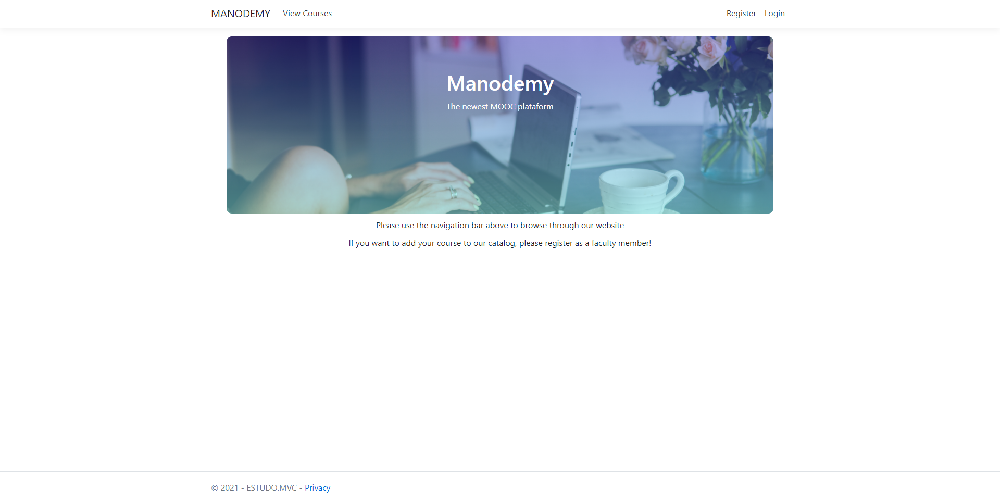
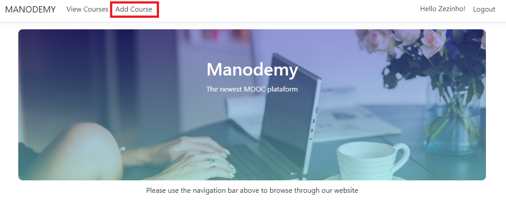
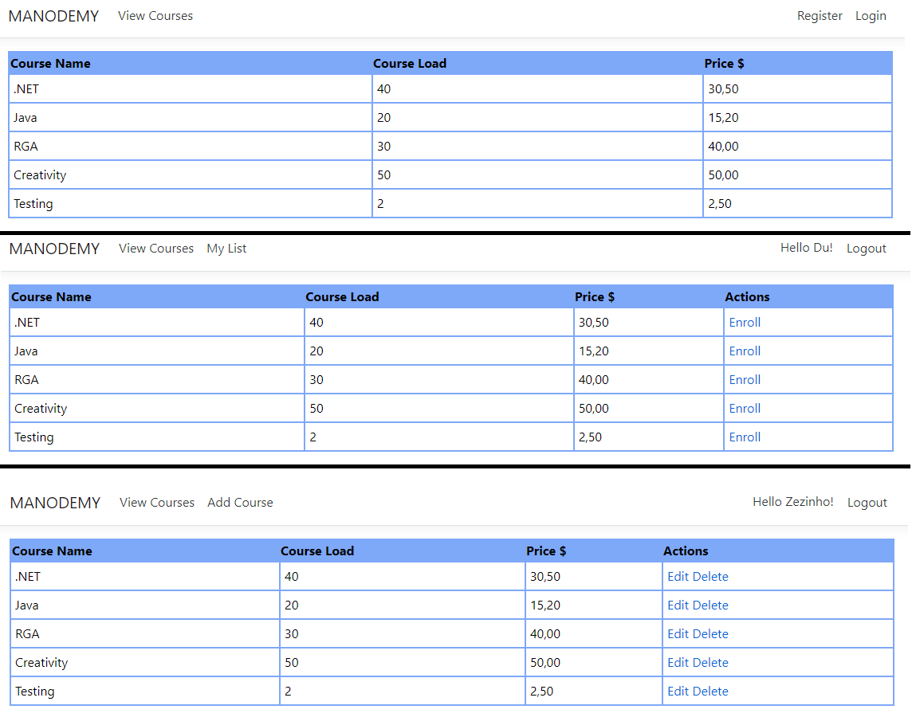
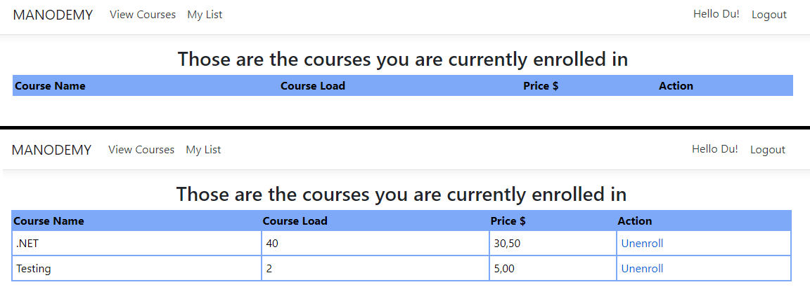
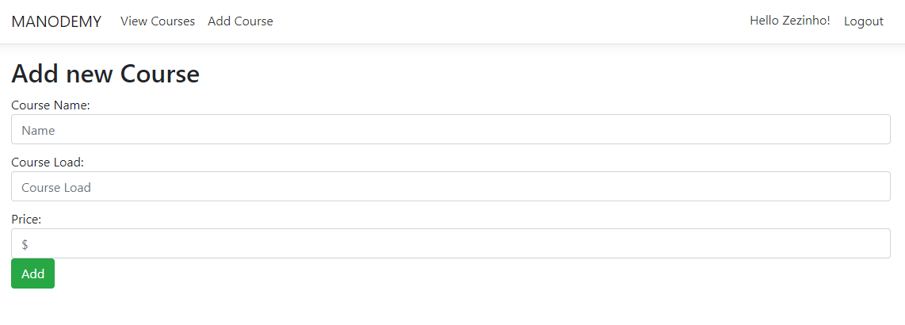
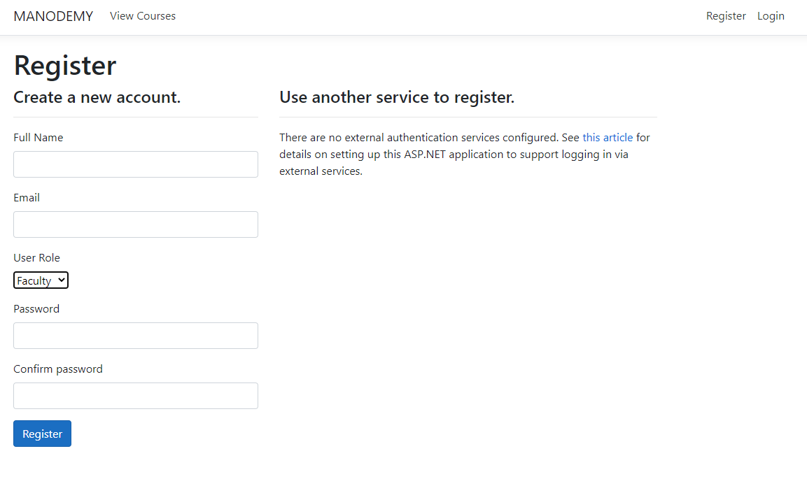

<h1 align="center">ESTUDO MVC</h1>

Implementação de um CRUD para demonstrar os conhecimentos adquiridos durante a fase de estudo MVC. Foram utilizados os conceitos: 

- Manipulação de models, views e controllers;
- Entity Framework para migração de entidades ao Banco de Dados MySQL;
- Identity para registro e login de usuário;
- Relacionamento de entidades;
- Conceitos básicos de front-end com HTML, CSS e Bootstrap.

---
## :computer: Descrição do programa 

## MANODEMY
O sistema desenvolvido simula uma plataforma simples de MOOC (Massive Open Online Course), onde usuários cadastrados como estudantes podem se matricular em cursos e usuários cadastrados como instrutores podem adicionar, editar e deletar cursos. 

## Home

O programa tem início na tela home, que apresenta uma mensagem inicial e de onde o usuário pode começar a navegar. Ele pode visualizar os cursos já existentes, fazer registro no sistema ou login.

_
Home page de usuário não logado
_

Caso o usuário esteja logado como usuário, verá na barra de navegação acima a opção de ver os cursos em que está matriculado.

_
Home page do estudante
_

No entanto, caso o usuário esteja logado como instrutor, aparecerá a opção para adicionar novo curso.

_
Home page do instrutor
_

---

## View Courses

Assim como na página principal, a página de visualização de cursos irá diferir a depender de qual usuário está visualizando. Caso seja um usuário não logado, aparecerão os dados de nome, carga horária e preço do curso; um estudante verá também a opção de se matricular nos cursos e o instrutor, por fim, poderá deletar e editar cursos.

Um curso só poderá ser deletado caso não haja estudantes matriculados e um estudante não poderá se matricular no mesmo curso mais de uma vez.

_
Visualização de cursos como usuário não identificado, estudante e instrutor, respectivamente
_

---

## My List

O estudante terá a opção de visualizar os cursos em que está matriculado e acesso à opção de se desmatricular. Dessa forma, a lista poderá se apresentar vazia ou com os cursos daquele estudante em específico.

_
Visualização de lista de cursos antes e após matrícula
_

---

## Add Course

O instrutor terá acesso à tela de cadastro de cursos, como visto abaixo:

_
Tela de adição de curso
_

---

## Register

A página de registro no sistema foi feita a partir do modelo criado com Identity e será através dela que o usuário irá definir se é instrutor ou estudante, além de incluir também seu nome completo. 

_
Tela de registro de usuário
_

---

